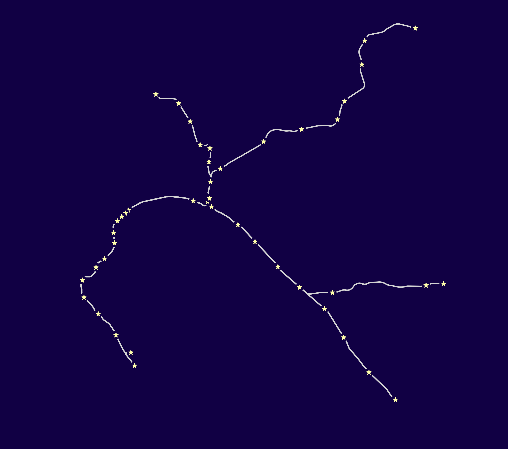

transit-star-maps
=================

transit maps that look like constellations because trains + stars = &lt;3

Buy t-shirts at [transitstarmaps.com](https://transitstarmaps.com/)
Follow us at [@transitstarmaps](https://twitter.com/transitstarmaps) and [facebook.com/transitstarmaps](https://facebook.com/transitstarmaps/)

What makes a good transit star chart?
-------------------------------------
 * The transit system needs to be complicated enough to be interesting. Sorry, [one-line systems](http://en.wikipedia.org/wiki/Link_Light_Rail) are boring.
 * Not too complicated! Sorry, [hundreds of stations and dozens of lines](http://en.wikipedia.org/wiki/New_York_City_Subway) is more complicated than any constellation. It wouldn't look right.
 * Preferably organic-looking. Systems that follow a lot of straight lines are less interesting and look less like real constellations. [This](outputs/bart_v0.2.png) is more interesting than [this](outputs/trimet_max_v0.1.png)
 * Ideally some hierarchy of stations so we can use different sizes of stars. Maybe express vs local stops, or transfer stations could be larger stars, etc. So far all the maps just use the same size of star.



Workflow:
---------

The stylesheet is designed with BART in mind.

Use tilemill's export panel. Export at target zoom of 13, and pixel width of the image of 3000px.

Using Zazzle, we upload a t-shirt image that roughly fills the printable area of a shirt, maybe 8 to 10 inches wide. So 3000px at 300 dpi makes sense.

The first test shirt ended up with stars that were about 1/8" of an inch wide. This is unsatisfying. For the next round, I'm trying 1/4" stars. At 300 dpi, this means the stars should be about 75 pixels wide.

Then, the image needs to be loaded into photoshop (or similar) to remove the background. For t-shirt printing the background needs to be transparent. But, we can't just generate a transparent image from tilemill, because we need the stars to have a black outline that cuts out the underlying paths.

Sources:
--------

| system | source |
|--------|--------|
| BART ||
| LA Metro |  http://developer.metro.net/introduction/gis-data/download-gis-data/ |
| Portland Trimet ||
| Vancouver Translink ||
| Toronto TTC | OpenStreetMap |
| Montréal | OpenStreetMap |
| Washington, D.C. | https://github.com/benbalter/dc-maps |
| Boston | https://github.com/singingwolfboy/MBTA-GeoJSON |

Getting the Data:
-----------------

Where possible, find existing GeoJSON, KML, or shapefiles. These are mostly likely to be cleanest and appropriately simplified. Public data is best especially if there are no attribution requirements.

You can also source the data from OSM using an [overpass query](http://overpass-turbo.eu/), like so:

```
/*
This query looks for nodes, ways and relations 
with the given key/value combination.
Choose your region and hit the Run button above!
*/
[out:json][timeout:25];
// gather results
(
  //node["railway"="station"][disused!='yes'][status!='construction']["operator"="Toronto Transit Commission"]({{bbox}});
  way["railway"="subway"]["service"!="siding"]["service"!="yard"]({{bbox}});
  relation["railway"="subway"]["service"!="siding"]["service"!="yard"]({{bbox}});
);
// print results
out body;
>;
out skel qt;
```


